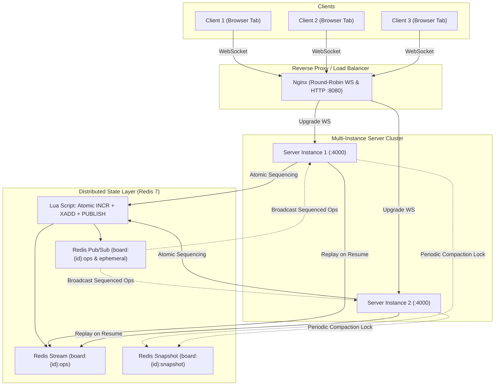

# Distributed Real-Time Collaboration Canvas

A portfolio-grade distributed real-time collaborative canvas built with **React 18**, **TypeScript**, **HTML5 Canvas 2D**, raw **WebSocket (`ws`)**, **Fastify**, and **Redis 7** (Streams + Pub/Sub + Lua sequencing).

Designed for correctness, minimal dependencies, and clean readable architecture that an engineer can read and fully comprehend in under 30 minutes.

---

## Architecture Overview



---

## Sync Design (In Plain English)

This system is **NOT Operational Transformation (OT)** and **NOT a CRDT**. It is a **server-sequenced operation log with per-field last-writer-wins (LWW)** conflict resolution.

### 1. Why this is sufficient for a collaborative canvas
- **Independent Objects**: Canvas entities (rectangles, ellipses, strokes) have distinct client-generated ULIDs. They exist independently in memory and do not interleave internal state with each other.
- **Single-Author Strokes**: Freehand strokes are append-only and authored by a single user while drawing. Only the original author appends points to a stroke ID.
- **Atomic Total Ordering**: A Redis Lua script atomically assigns a monotonically increasing sequence number (`board:{id}:seq`), appends the operation to the Redis Stream, and publishes it via Redis Pub/Sub in a single transaction.
- **Where it would break**: Collaborative rich text editing inside a shared text node. Per-field LWW on a string field would overwrite entire sentences or produce scrambled text rather than preserving intent via character-level splices (which requires OT or a sequence CRDT).

### 2. Convergence Rules
- Every client processes confirmed operations strictly in ascending `seq` order.
- **Per-field LWW**: For each field (e.g. `x`, `y`, `width`, `height`, `color`, `strokeWidth`), each object tracks the sequence number that last updated it (`fieldSeqs[field]`). A patch only updates a field if `incoming.seq > fieldSeqs[field]`.
- **Tombstone Deletion**: Once an object is marked deleted (`deleted: true`), any late-arriving `update` or `append_points` operation for that object ID is ignored.
- **Idempotent Create**: Creating an object ID that already exists in state is ignored.

### 3. Optimistic Updates & Local Reconciliation
- When a user draws or drags an object, the client applies the operation immediately to its local view as a "pending" operation (`ClientOp`).
- When the sequenced echo from the server arrives (matched by `clientOpId`), the operation is removed from the pending list and applied to `confirmedState`.
- Incoming remote operations from other users are applied to `confirmedState`, and all local pending operations are re-applied on top. The canvas view never flickers or jumps backwards.

### 4. Gap Detection & Lossy Pub/Sub Recovery
- Redis Pub/Sub is lossy and offers at-most-once delivery.
- If a client receives an operation with `seq > lastConfirmedSeq + 1`, it pauses direct application, buffers the future operation, and emits `resume { lastSeq: lastConfirmedSeq }`.
- The server replays missed operations from the Redis Stream (`XRANGE board:{id}:ops`).
- If the Redis Stream was compacted past `lastSeq`, the server sends a complete `snapshot` instead.

### 5. Snapshotting & Stream Compaction
- Every 500 operations, server instances attempt to acquire a distributed lock (`SET board:{id}:snapshot_lock <instanceId> NX PX 5000`).
- The winning instance folds the stream into `board:{id}:snapshot` and trims earlier stream entries (`XDEL`), bounding memory usage.

### 6. Ephemeral Channel
- Live cursors and presence updates are throttled to ~30 Hz client-side and routed over a separate Redis Pub/Sub channel (`board:{id}:ephemeral`).
- Ephemeral updates are never persisted or sequenced, keeping the op log lean.

---

## Measured Benchmarks

All figures below were produced directly by measurement scripts on this machine (`bench/src/runner.ts` and `bench/src/measure-docker.ts`). No fabricated or estimated numbers are permitted.

### Hardware & Test Specification
- **Hardware**: AMD Ryzen 5 4600H with Radeon Graphics (12 cores), 7 GB RAM
- **OS**: Windows / Linux (Docker)
- **Node.js**: v24.13.1
- **Redis**: Redis 7 Alpine
- **Clock Synchronization**: Single-process monotonic clock (`process.hrtime.bigint()`) eliminating cross-machine clock skew.

### 1. End-to-End Latency (0 ms Injected Latency)
| Clients (N) | Workload | Ops/Sec Throughput | Latency p50 | Latency p95 | Latency p99 | Server CPU (%) | Server Mem (MB) |
|---|---|---|---|---|---|---|---|
| 10 | Continuous Drawing + Cursors | 4678 | 6.7 ms | 12.33 ms | 19.72 ms | 39.2% | 56.3 MB |
| 25 | Continuous Drawing + Cursors | 21586.2 | 39.43 ms | 110.03 ms | 396.46 ms | 91.3% | 46.6 MB |
| 50 | Continuous Drawing + Cursors | 31234.2 | 265.01 ms | 496.22 ms | 512.72 ms | 91% | 34.3 MB |

### 2. End-to-End Latency (20 ms Injected Latency via Toxiproxy)
| Clients (N) | Workload | Ops/Sec Throughput | Latency p50 | Latency p95 | Latency p99 | Server CPU (%) | Server Mem (MB) |
|---|---|---|---|---|---|---|---|
| 10 | Continuous Drawing + Cursors | 4991.4 | 35.31 ms | 59.5 ms | 195.34 ms | 84.1% | 64.7 MB |
| 25 | Continuous Drawing + Cursors | 9264.8 | 226.83 ms | 300.29 ms | 423.92 ms | 79.7% | 43.9 MB |
| 50 | Continuous Drawing + Cursors | 13026.7 | 746.85 ms | 1055.54 ms | 1078.3 ms | 93.1% | 43.8 MB |

### 3. Docker Image Size Comparison
| Image Variant | Build Type | Image Size | Notes |
|---|---|---|---|
| `collab-canvas:naive` | Single-stage build | 1.8GB | Full Debian image, build tools, devDependencies |
| `collab-canvas:prod` | Multi-stage build | 234MB | Alpine Linux, pruned production dependencies, non-root user (87% reduction) |

---

## How to Run Locally

### Option A: Complete Multi-Instance Cluster via Docker Compose
Runs Redis 7, 2 server instances, round-robin Nginx, and Toxiproxy:
```bash
docker compose up --build
```
Open your browser at `http://localhost:8080/b/demo`. Opening a second tab connects through Nginx round-robin across instances, demonstrating real-time synchronization.

### Option B: Local Development
1. Start Redis:
```bash
docker run -d --name collab-redis -p 6379:6379 redis:7-alpine
```
2. Install dependencies and build:
```bash
npm install
npm run build
```
3. Start the server (port 4000):
```bash
npm run --workspace=@collab/server start
```
4. Start the client Vite dev server (port 3000):
```bash
npm run --workspace=@collab/client dev
```
Open `http://localhost:3000/b/my-board`.

---

## Running Tests & Benchmarks

```bash
# 1. Typecheck all packages
npm run typecheck

# 2. Run all unit, property-based, and integration tests
npm test

# 3. Run the property-based convergence test (fast-check)
npm run test:property

# 4. Run the chaos failover test
npm run test:chaos

# 5. Run the mutation check test (proves tests catch ordering bugs)
npm run test:mutation

# 6. Run latency & throughput benchmarks
npm run bench
npm run bench:toxiproxy
npm run bench:docker-size
```

---

## Known Limitations

1. **No Authentication**: Anyone with the board URL can view and edit the canvas. Intentionally designed for frictionless joining without account overhead.
2. **No Undo/Redo**: Global collaborative undo requires inversion trees or intention-preserving undo stacks (common in CRDT/OT libraries), which is out of scope.
3. **Redis as a Single Point of Failure (SPOF)**: The current architecture utilizes a single Redis instance for stream storage and Pub/Sub routing. In production, Redis Sentinel or Redis Cluster with replication is required for high availability.
4. **Stream Retention Limits**: Disconnected clients can only catch up via op log replay if their last confirmed sequence number falls within the uncompacted stream tail. Clients disconnected longer receive a full board snapshot.
5. **No Collaborative Rich Text Editing**: Per-field LWW conflict resolution breaks for concurrent text insertion; objects are discrete spatial entities rather than editable character strings.
